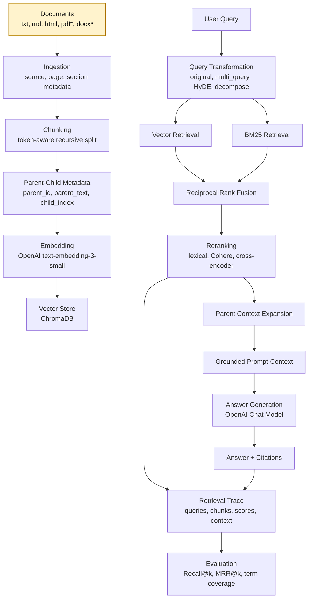

# RAGLab

RAGLab is a modular Retrieval-Augmented Generation framework for experimenting with modern RAG techniques: multi-format ingestion, token-aware chunking, hybrid retrieval, query transformation, reranking, grounded citations, retrieval tracing, and retrieval evaluation.

The project is designed as a practical RAG lab rather than a single hard-coded chatbot. Each stage of the pipeline is modular, testable, and replaceable, so different retrieval strategies can be compared with deterministic evaluation instead of judged only by subjective answer quality.

## Highlights

- Multi-format document ingestion for `.txt`, `.md`, `.html`, with optional `.pdf` and `.docx` parsers
- Metadata-preserving indexing with `source`, `section`, `page`, `chunk_id`, `created_at`, `parent_id`, and `parent_text`
- Token-aware recursive chunking with section/header awareness and parent-child context expansion
- Hybrid retrieval combining dense vector search, BM25 lexical retrieval, and Reciprocal Rank Fusion
- Query transformation strategies: original query, multi-query expansion, HyDE-style expansion, and decomposition
- Optional OpenAI-backed query rewriting with deterministic fallback
- Reranking layer with lexical fallback, Cohere API reranking, and local cross-encoder reranking
- Grounded answer trace with citations, retrieved chunks, generated queries, rerank scores, and final context
- Retrieval evaluation harness with Recall@k, MRR@k, and expected term coverage

## Architecture



`pdf*` and `docx*` are optional parsers. Install `pypdf` and `python-docx` to enable them.

## Repository Structure

```text
RAGLab/
  rag.py                     # Compatibility CLI entry point
  raglab/
    agent.py                 # Main DocumentQAAgent orchestration
    ingestion.py             # Multi-format document loading
    chunking.py              # Token-aware recursive chunking
    retrieval.py             # BM25, vector result fusion, RRF
    reranking.py             # Lexical, Cohere, cross-encoder rerankers
    query_transform.py       # Query rewrite/decomposition strategies
    context.py               # Parent-child context expansion
    prompting.py             # Grounded prompt construction
    tracing.py               # Citation and trace helpers
    evaluation.py            # Retrieval evaluation harness
    schema.py                # Shared dataclasses
  examples/
    golden_qa.jsonl          # Example labelled retrieval dataset
  tests/                     # Unit tests for core pipeline components
```

## Installation

```powershell
python -m venv .venv
.\.venv\Scripts\activate
pip install openai chromadb python-dotenv rich
```

Optional document parsers:

```powershell
pip install pypdf python-docx
```

Optional rerankers:

```powershell
pip install cohere sentence-transformers
```

Create a `.env` file if you use OpenAI or Cohere-backed components:

```text
OPENAI_API_KEY=...
COHERE_API_KEY=...
```

## Quick Start

Run the interactive demo:

```powershell
python rag.py
```

Inside the CLI:

```text
sources
add path/to/document.md
What does this document say about retrieval?
quit
```

## Programmatic Usage

```python
from raglab.agent import DocumentQAAgent

agent = DocumentQAAgent(
    retrieval_mode="hybrid",
    query_mode="multi_query",
    reranker="lexical",
)

agent.add_file("docs/guide.md")
answer = agent.ask_with_trace("How does the system rerank retrieved chunks?")

print(answer.text)
print(answer.citations)
print(answer.trace.generated_queries)
print(answer.trace.retrieved_chunks)
```

## Retrieval Modes

```python
DocumentQAAgent(retrieval_mode="vector")
DocumentQAAgent(retrieval_mode="bm25")
DocumentQAAgent(retrieval_mode="hybrid")
```

Hybrid retrieval combines vector search and BM25, then merges ranked candidates with Reciprocal Rank Fusion.

## Query Transformation

```python
DocumentQAAgent(query_mode="original")
DocumentQAAgent(query_mode="multi_query")
DocumentQAAgent(query_mode="hyde")
DocumentQAAgent(query_mode="decompose")
```

For LLM-backed rewriting:

```python
from openai import OpenAI
from raglab.agent import DocumentQAAgent
from raglab.query_transform import OpenAIQueryTransformer

client = OpenAI()
query_transformer = OpenAIQueryTransformer(
    mode="multi_query",
    client=client,
    model="gpt-4.1-mini",
)

agent = DocumentQAAgent(query_mode=query_transformer)
```

If the LLM rewrite fails, the system falls back to the deterministic strategy for that mode.

## Reranking

Default deterministic fallback:

```python
DocumentQAAgent(reranker="lexical")
```

Cohere API reranker:

```python
DocumentQAAgent(reranker="cohere")
```

Local cross-encoder reranker:

```python
DocumentQAAgent(reranker="cross_encoder")
```

Custom client or preloaded model:

```python
from raglab.reranking import CohereReranker, CrossEncoderReranker

agent = DocumentQAAgent(reranker=CohereReranker(client=cohere_client))
agent = DocumentQAAgent(reranker=CrossEncoderReranker(model=my_model))
```

## Evaluation

Run retrieval evaluation against a labelled JSONL dataset:

```powershell
python -m raglab.evaluation --dataset examples/golden_qa.jsonl --retrieval-mode hybrid --query-mode multi_query -k 5
```

The evaluator reports:

- Recall@k
- MRR@k
- Expected term coverage
- Per-question PASS/MISS status

Example dataset row:

```json
{"question": "Who created Python?", "expected_sources": ["Python Basics"], "expected_terms": ["Guido van Rossum"]}
```

## Testing

```powershell
python -m unittest discover -s tests
```

Current tests cover ingestion, chunking, retrieval fusion, reranking, query transformation, tracing, context expansion, and evaluation.

## Why This Project Matters

Basic RAG demos often stop at embedding documents and asking questions. RAGLab goes further by exposing the decisions that determine retrieval quality:

- How should documents be parsed and chunked?
- When does lexical search outperform semantic retrieval?
- Do query transformations improve recall?
- Does reranking improve the final context?
- Which chunks actually support the answer?
- Can retrieval strategies be evaluated deterministically?

This makes the project useful both as a working document QA system and as an experimental framework for comparing practical RAG techniques.

## Technical Skills Demonstrated

- Retrieval-Augmented Generation
- Information Retrieval
- Vector databases and ChromaDB
- Hybrid search and Reciprocal Rank Fusion
- Query rewriting and decomposition
- Reranking with API and local cross-encoder models
- Metadata-aware document ingestion
- Evaluation design for LLM applications
- Python modular architecture and unit testing

